# Prefix Sampling：以 50% rollout pass rate 为目标，提升 agentic RL 训练效率

Tianshu Zhu, Wenyu Zhang, Lun Tian, Haotian Zhao, Haifeng Zhang, Ruijie Xu, Yuxin Zhang, Jingnan Gu*, Daxiang Dong*, Jianmin Wu*

*通讯作者

> By Baidu | Work In Progress | Published on TBD

## TL;DR

| | |
| --- | --- |
| 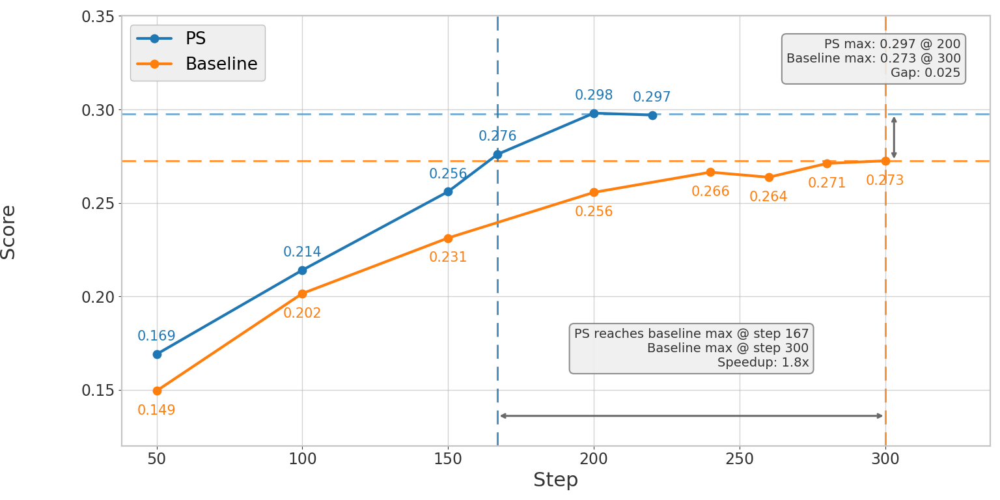 | 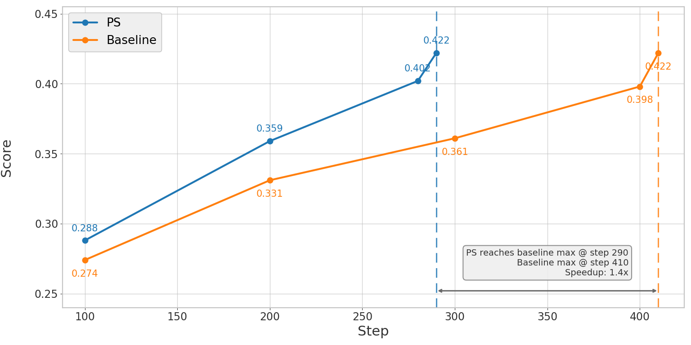 |

*图 1. 左图：Qwen3-14B 的 SWE-bench Verified pass@1 分数随训练步数变化，结果为 3 次实验取平均。PS 以 1.8x 更少的训练步数达到 baseline 的峰值分数，并最终达到 0.298，对比 baseline 的 0.273。右图：Qwen3-32B 的 SWE-bench Verified pass@1 分数随训练步数变化，结果同样为 3 次实验取平均。PS 在 step 290 达到 baseline 的最佳分数 0.422，而 baseline 在 step 410 才达到相同分数。*

面向 coding agent 的强化学习（RL）会在大量 rollout pass rate 偏斜的任务上浪费不少算力。  
当模型几乎总是失败，或者几乎总是成功时，梯度信号都会变得很弱，而且带有明显偏置。**50% 的 rollout pass rate 可以最大化梯度信号**，这正是我们要追求的目标。

**Prefix Sampling（PS）是把 rollout pass rate 拉向 50% 的一种直接方法：** 它通过重放 trajectory prefix，把每个任务的有效 rollout pass rate 推向 50%，也就是 binary-reward RL 在信息论意义上的最优点。对于大多数 rollout 都失败的任务，PS 会从一条罕见的成功轨迹中给模型一个 head start；对于大多数 rollout 都成功的任务，PS 会从一条罕见的失败轨迹中给模型一个 handicap。两种情况下，本来带偏的低质量信号都会被转化为更平衡、信息量更高的训练信号。

在 Qwen3-14B（SWE-bench, R2E_Gym）上，基于 3 次实验取平均，PS 在达到相同 SWE-bench Verified pass@1 分数时，端到端速度提升约 **2.07x**（1.80x 更少训练步数 × 1.15x 更快单步速度），并且最终的 pass@1 分数也更高：**0.298** 对比 baseline 的 **0.273**。也就是说，它不仅更快，而且最终效果也更好。

在 Qwen3-32B（SWE-bench, R2E_Gym）上，基于 3 次实验取平均，PS 在达到相同 SWE-bench Verified pass@1 分数时，端到端速度提升约 **1.54x**（**1.40x** 更少训练步数 × **1.10x** 更快单步速度），并且**不牺牲最终性能**。

## 大多数 RL 任务的 Rollout Pass Rate 都不对

在我们的 SWE-bench RL 训练设置中（Qwen3-14B、每个任务 `N=8` 个 rollouts、`batch_size=64`），任务大致会落在几类学习效率完全不同的区间里：

- **All fail**（0/8 rollout pass rate）：模型完全解不出来。梯度信号为零，会被 rejection sampling 丢弃。
- **All pass**（8/8 rollout pass rate）：模型次次都能做对。梯度信号同样为零，也会被丢弃。
- **Heavily skewed**（1/8、2/8、6/8、7/8）：严格来说仍然有非零信号，但偏置很重。少数离群轨迹承载了几乎全部信息，advantage estimate 也会更噪、更低效。这类任务确实能参与训练，但远远没有发挥应有价值。
- **Balanced**（3/8、4/8、5/8）：这是最理想的区间。正负 rollout 大致平衡，能够提供强而清晰的对比性梯度信号。

标准做法是 **rejection sampling**：把 rollout pass rate 为 0% 或 100% 的任务直接丢掉。  
但这只能处理最极端的两端。我们的 baseline 训练里，每个 batch 64 个任务中，只有大约 26 个任务具有 partial rollout pass rate（也就是 `solve_partial` 指标统计到的任务），而且其中很多仍然高度偏斜。  
结果就是：大量算力最终只换来了很弱的学习信号。根本原因在于，大多数任务离能够最大化梯度信号的 50% rollout pass rate 都还很远。

**Prefix Sampling 的关键洞察在于：** all-fail 和 all-pass 的任务救不回来，因为根本没有成功或失败轨迹可供复用。  
但那些严重偏斜的任务（比如 1/8 或 7/8 rollout pass rate）是可以回收利用的。方法是重放一段 trajectory prefix，直接改变任务的有效难度。  
对于大多数失败的任务，用一条罕见成功轨迹的 prefix 给模型一个 head start，把 rollout pass rate 往 50% 推；对于大多数成功的任务，则用一条罕见失败轨迹的 prefix 给模型加 handicap，让成功重新变得不那么轻松。  
这样一来，原本低质量、带偏的训练信号，就能转化成更平衡、信息量更高的信号。

## 为什么 50% Rollout Pass Rate 是最优目标

先给结论：对于 binary-reward RL，**50% rollout pass rate 就是最优目标**。它同时最大化信息量、最大化 GRPO 信号强度，并提供最丰富的对比式 credit assignment 结构。  
完整的数学证明我们放在文末，紧挨着 `Citation` 之前。

**Reader shortcut（先看结论）：**
- 信息量 `H(p)`、GRPO 信号强度 `p(1-p)`、以及对比结构 `k(N-k)` 都在 `p=0.5` 处达到最大。
- 偏斜任务（例如 `1/8` 或 `7/8`）并不是完全不能训练，但 sample efficiency 会明显更差。
- Prefix Sampling 的核心作用，就是把这些偏斜任务往这个高信号区间推过去。

## Prefix Sampling 是怎么把 Rollout Pass Rate 调整到50%的


*图 2. Prefix Sampling 工作流。训练 batch 由 dataloader 的新任务和上一轮缓存的 prefix tasks 共同组成。任务按照 rollout pass rate 被分成五类：all-fail、all-pass、normal、too-hard、too-easy；其中 too-hard 和 too-easy 会经过 Prefix & Mask 模块，生成新的 prefix task，再注入下一轮 mixed batch。*

上图展示了 Prefix Sampling 的完整工作流。  
每一步训练时，我们都会构造一个 mixed batch，它由两部分组成：来自 dataloader 的新任务，以及前几步积累下来的 prefix tasks。  
每个任务都会运行 `N` 个 rollouts，并使用 **prefix replay**。新任务从头开始；而 prefix tasks 则从恢复出来的环境状态继续执行。  
根据 rollout pass rate，每个任务会落入五条路径中的一条：

**All-Fail (0%)：** 所有 `N` 个 rollouts 都失败。由于没有成功轨迹，无法构造有用 prefix，因此这类任务会通过 rejection sampling 直接丢弃。

**All-Pass (100%)：** 所有 `N` 个 rollouts 都成功。由于没有失败轨迹，同样无法构造有意义的 prefix，也会被丢弃。

**Normal (30%-70%)：** 通过率已经处于较平衡区间。这类任务的 RL 训练信号本身就比较高质量，不需要额外做 prefix 干预。

**Too-Easy (70%-100%)：** 大多数 rollouts 都成功，但至少有一个失败。原始 rollouts 仍然参与训练；同时，我们会保存一条失败轨迹，并送入 **Prefix & Mask**。通过 **prefix selection**，从这条失败轨迹中截取一段 prefix；再通过 **adaptive prefix** 控制 prefix 长度，使 rerollout 后的目标 rollout pass rate 接近 50%。选中的 prefix 在训练时会被 mask，剩余被丢弃的部分则不参与训练。这个 prefix task 会被放回下一轮 batch，在那里以失败 prefix 作为一种“handicap”重新被执行。

**Too-Hard (0%-30%)：** 大多数 rollouts 都失败，但至少有一个成功。原始 rollouts 同样参与训练；此外，我们会保存一条成功轨迹并送入 **Prefix & Mask**。其中一部分成功轨迹会变成 prefix，在下一轮 replay 时给模型一个“head start”。

简化来看：
- **Drop：** all-fail 和 all-pass，沿用标准 rejection sampling。
- **Train directly：** normal tasks，本来就在高质量区间。
- **Recycle：** too-hard 和 too-easy，通过 prefix replay 把 rollout pass rate 重新拉回平衡区间。

整个机制的关键在于：**prefix replay** 负责恢复保存轨迹对应的环境状态，**prefix selection** 决定要重放多长的前缀，**prefix masking** 确保前缀 token 不参与梯度更新，而 **adaptive prefix** 则用于把目标 rollout pass rate 稳定在约 50%。这样，原本通过率偏斜的任务就能通过这个 prefix-guided replay loop，转化为信息量更高的训练样本。

### Prefix Replay

在多回合 coding agent 环境中，“replay 一个 prefix”到底是什么意思？

这和单轮 reasoning task 很不一样。对后者来说，prefix 往往只是简单地在输入前拼接一段文本；但 SWE-bench 轨迹是有状态的，智能体会读取文件、编辑代码、运行测试，并持续维护对话历史。  
因此，replay 一个 prefix 的真正含义是：**把某条历史轨迹在某个步骤上的完整环境状态恢复出来**。

具体来说，这个恢复过程包括：

1. **Code state：** 把步骤 `K` 之前的所有文件修改应用回代码仓库。
2. **Conversation history：** 加载步骤 `K` 之前的完整对话内容，包括用户消息、agent 回复和工具输出。
3. **Execution context：** 把 agent 放回 prefix 轨迹停下来的那个精确位置。

在这个恢复出来的状态上，模型会继续生成新的后续轨迹，并自己决定接下来做什么。  
需要强调的是，prefix 本身并不是训练时要学习模仿的输入内容；它只是新 rollout 的**起始条件**。这和 SFT 是本质不同的，SFT 会直接训练模型去模仿这些 prefix 动作，而 PS 不会。

### Prefix Selection

那么，应该选哪条轨迹，又应该重放多长？

- **Too-hard tasks → Successful prefix：** 重放一条罕见成功轨迹的前 `K` 步，给模型一个 head start，从而把 rollout pass rate 往 50% 提高。
- **Too-easy tasks → Failing prefix：** 重放一条罕见失败轨迹的前 `K` 步，给模型一个 handicap，从而把 rollout pass rate 往 50% 拉低。

前缀长度 `K` 由一个 **ratio** 和一个 **cap** 共同决定。

**Too hard（remaining steps mode）：**
```
remaining = min(int(total_steps × remaining_ratio), remaining_cap)
target_step = total_steps - remaining
```

当 `remaining_ratio=0.25` 时，如果一条轨迹总共 20 步，那么会 replay 前 15 步，由模型自己完成最后 5 步。

**Too easy（prefix steps mode）：**
```
target_step = min(int(total_steps × prefix_ratio), prefix_cap)
```

当 `prefix_ratio=0.25` 时，20 步轨迹会 replay 一条失败轨迹的前 5 步。

`cap` 的作用是避免在很长的轨迹上得到过长的 prefix。  
在实际实验中，固定比率 `prefix_ratio=0.25` 和 `remaining_ratio=0.25` 已经能在不同任务和模型能力区间上取得不错效果。

### Prefix Masking

一个非常关键的设计是：**prefix tokens 不参与梯度更新。**训练时，prefix 区域的 response mask 会被置为 0，只有模型在 prefix 之后自己生成的 continuation 才会接收到梯度信号。

为什么这点很重要？  
如果不做 mask，prefix 也会参与 advantage 计算。这样一来，如果 continuation 失败，prefix 对应的步骤就会收到负 advantage，相当于惩罚模型并没有真正做出的动作；如果 continuation 成功，prefix 步骤又会收到正 advantage，相当于奖励来自另一条轨迹的决策。无论哪种情况，本质上都变成了让模型去模仿或规避别人做过的动作，这更像 SFT，而不是 RL。

加上 mask 之后，训练目标就保持为纯粹的 RL：模型只会因为**自己**在当前起始状态下做出的决策而得到奖励或惩罚。

### Adaptive Prefix（可选）

*注意：本文中的 Qwen3-14B 实验使用固定 ratio；下面新增的 Qwen3-32B 实验则启用了 adaptive prefix。*

固定 ratio 虽然已经足够有效，但随着模型能力提升，最优 prefix 长度也会不断变化。某个 ratio 在 step 10 时也许能把 prefix task rollout pass rate 调到 50%，但到了 step 100，模型可能已经更擅长从 prefix 往后接，这时同样的 ratio 可能会让通过率变成 80%。

因此，PS 还可以配一个自适应反馈回路：

1. **跟踪各类 prefix task 的 rollout pass rate**，使用指数滑动平均（EMA，`α=0.05`，约 `13.5-step half-life`）。
2. **当 EMA 偏离 0.5 目标区间时调整 ratio**：
   - 如果 prefix task rollout pass rate > `0.53`：增大 ratio（更少 prefix → 任务更难）
   - 如果 prefix task rollout pass rate < `0.47`：减小 ratio（更多 prefix → 任务更容易）
   - 每次调整步长为 `±0.05`
3. **每次调整后加入 5-step cooldown**，防止由于 EMA 延迟导致的过冲。

这个 cooldown 很重要。因为 EMA 会跨多个 step 做平滑，所以 ratio 的变化不会立刻反映在指标上。  
如果没有 cooldown，控制器可能会沿着同一个方向持续调整，最终 overshoot 到目标之外。

## 结果：把目标对准 50%，训练就会更快

我们在完全相同的基础设施和超参数设置下，将 Prefix Sampling 与 baseline 进行了对比。baseline 采用的是 [DeepSWE](https://www.together.ai/blog/deepswe) 的训练设定，它是面向 SWE-bench coding agent RL 的一个强基线：使用 GRPO，并通过 rejection sampling 去掉 all-fail 和 all-pass 任务。

本文涉及的 14B 和 32B 两组实验，共享相同的核心训练配方：`batch_size=64`、`max_prompt_length=4096`、每个任务 `8` 个 rollouts、训练集为 `R2E_Gym_Subset`、验证集为 `SWE_Bench_Verified_0726`。二者的主要差异在于 `max_response_length`（14B 为 `32768`，32B 为 `65536`）、`agent.max_steps`（`50` vs `100`），以及 prefix 控制方式（14B 使用 fixed ratios，32B 启用 adaptive prefix）。

### 实验配置

#### Qwen3-14B

| | Baseline | Prefix Sampling |
|---|---|---|
| Model | Qwen3-14B | Qwen3-14B |
| Task | R2E_Gym_Subset | R2E_Gym_Subset |
| Rollouts per task | 8 | 8 |
| Batch size | 64 | 64 |
| Max prompt length | 4096 | 4096 |
| Max response length | 32768 | 32768 |
| Agent max steps | 50 | 50 |
| Rejection sampling | Yes (0%, 100%) | Yes (0%, 100%) |
| PS thresholds | — | low=0.3, high=0.7 |
| PS control | — | fixed ratios |
| Too-hard remaining ratio | — | 0.75 |
| Too-easy prefix ratio | — | 0.25 |

#### Qwen3-32B

| | Baseline | Prefix Sampling |
|---|---|---|
| Model | Qwen3-32B | Qwen3-32B |
| Task | R2E_Gym_Subset | R2E_Gym_Subset |
| Rollouts per task | 8 | 8 |
| Batch size | 64 | 64 |
| Max prompt length | 4096 | 4096 |
| Max response length | 65536 | 65536 |
| Agent max steps | 100 | 100 |
| Rejection sampling | Yes (0%, 100%) | Yes (0%, 100%) |
| PS thresholds | — | low=0.3, high=0.7 |
| PS control | — | adaptive prefix |
| Initial too-hard remaining ratio | — | 0.45 |
| Initial too-easy prefix ratio | — | 0.55 |
| Too-easy prefix cap | — | 30 |

### Training Efficiency：收敛更快，成本更低

| | |
| --- | --- |
| 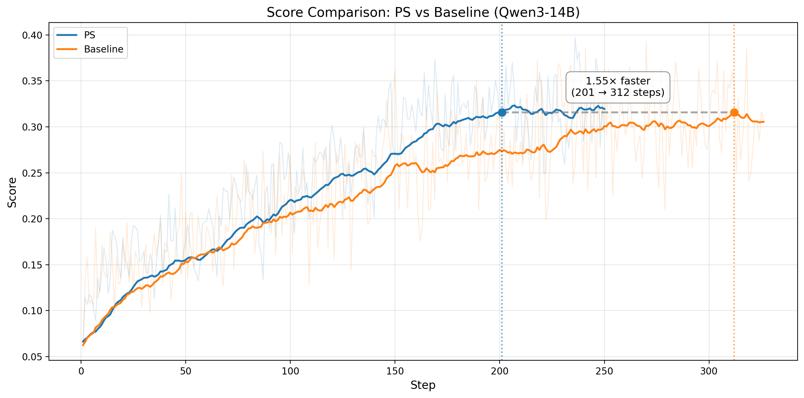 | 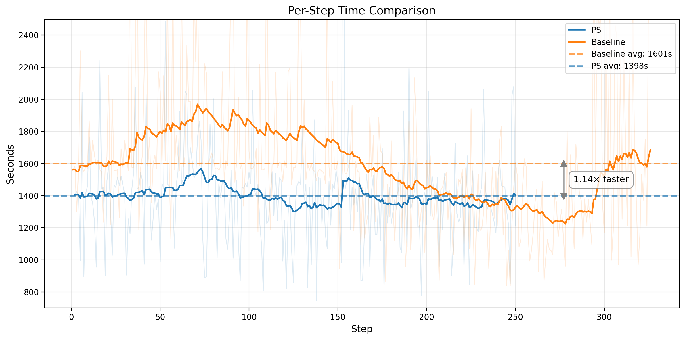 |
| 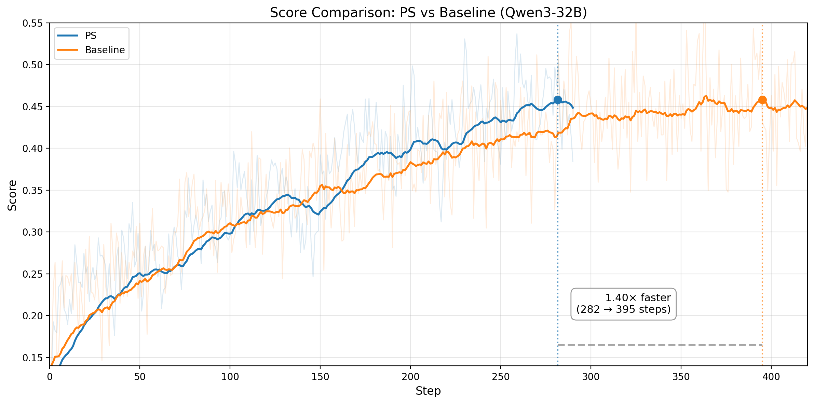 | 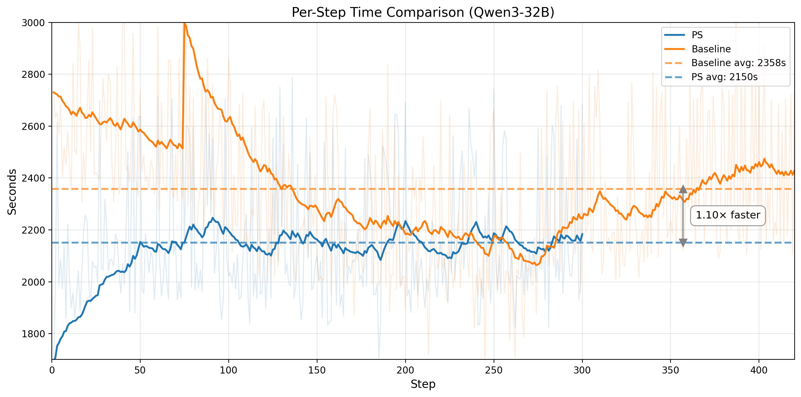 |

*图 3. 第一行：Qwen3-14B。左图：不含 prefix 的训练任务，其 rollout pass rate 随训练步数变化。水平线表示 baseline 的收敛分数，PS 以 1.55x 更快的速度达到该分数，并继续提升。右图：每个训练 step 的平均 wall-clock 时间（`1398s` vs `1601s`）。第二行：Qwen3-32B。左图：训练 score 对比，PS 在 step `282` 达到 baseline 等效 score，而 baseline 需要 `395`。右图：每个训练 step 的平均 wall-clock 时间（`2150s` vs `2358s`）。*

这个模式在两种模型规模上都一致。对于 Qwen3-14B，PS 在 **201** steps 达到 baseline 的收敛水平，而 baseline 需要 **312** steps，也就是 **1.55x 的 step-efficiency 提升**；同时，PS 的单步训练速度也快约 **1.15x**，最终带来 **~1.78x 的端到端加速**（`78h` vs `139h`）。对于 Qwen3-32B，PS 在 **step 282** 达到 baseline 等效训练 score，而 baseline 需要 **395**，对应 **1.40x 的 step-efficiency 提升**；同时，它的单步速度也快约 **1.10x**，合起来大致对应 **~1.54x 的端到端加速**。

### 更高质量、也更多的有效训练样本

| | |
| --- | --- |
| 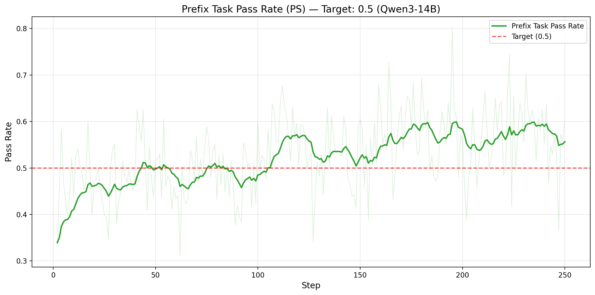 | 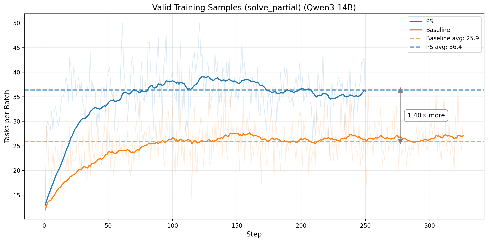 |
| 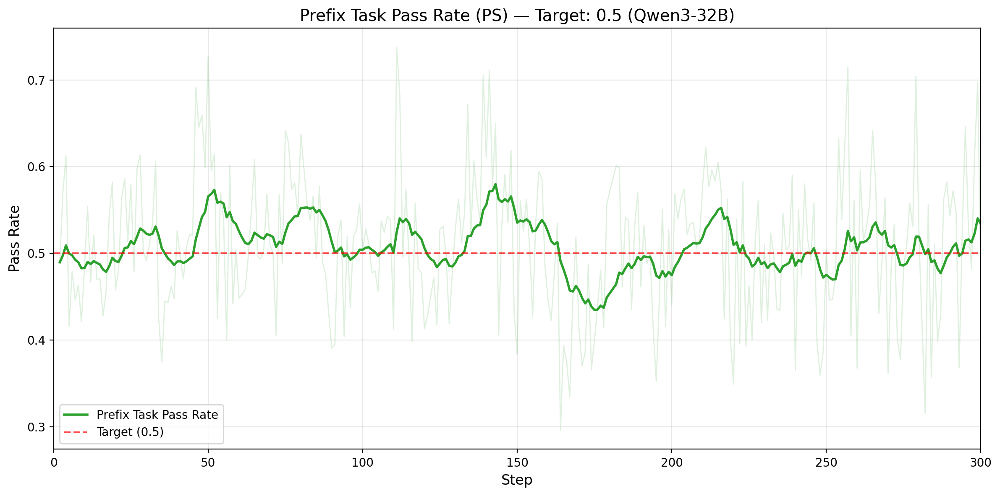 | 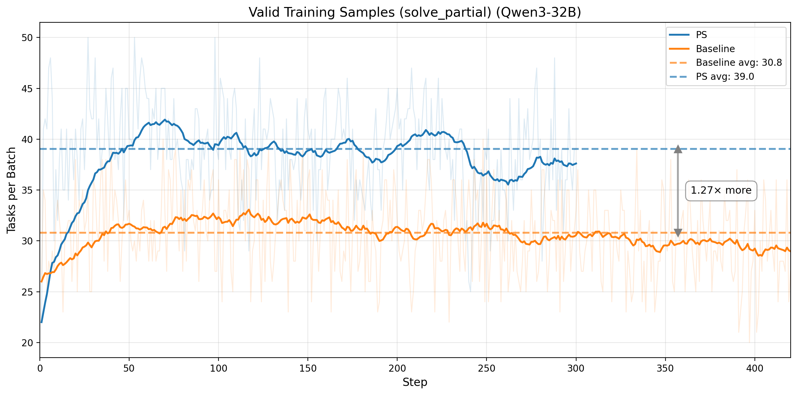 |

*图 4. 第一行：Qwen3-14B。左图：仅统计 prefix tasks 的 rollout pass rate（目标为 `0.5`），均值 `0.529`、标准差 `0.078`。右图：每个 batch 的有效训练任务数量（`solve_partial`），从 `25.9` 提升到 `36.5`。第二行：Qwen3-32B。左图：在 adaptive prefix 控制下，prefix-task rollout pass rate 稳定围绕 `0.5` 目标波动。右图：每个 batch 的有效训练任务数量从 `30.8` 提升到 `39.0`。*

效率提升来自把偏斜且低质量的训练信号，转化成更平衡、信息量更高的训练信号。对于 Qwen3-14B，prefix-task rollout pass rate 在整个训练过程中都稳定靠近 0.5，PS 也把每个 batch 的有效训练任务数从 **25.9** 提升到 **36.5**，也就是 **41%** 的增幅。对于 Qwen3-32B，在 adaptive prefix 控制下同样成立：prefix-task rollout pass rate 仍然稳定围绕 **0.5**，而每个 batch 的有效训练任务数从 **30.8** 提升到 **39.0**，也就是每步能拿到 **1.27x 更多** 的高价值样本。两组结果都说明，PS 同时提升了训练样本的数量和信息密度。

### 更高的 Entropy，更好的 Exploration

| | |
| --- | --- |
| 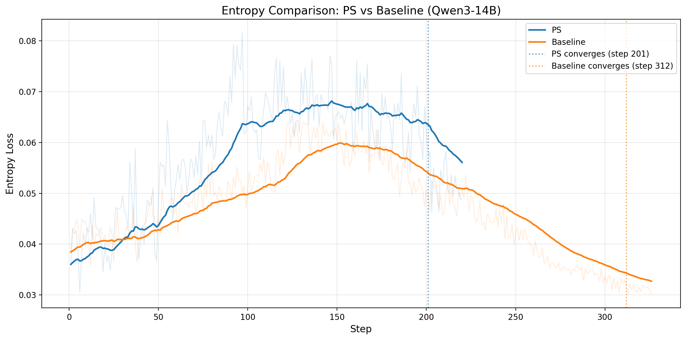 | 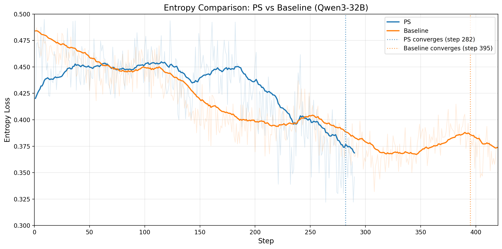 |

*图 5. 左图：Qwen3-14B 的输出 entropy 随训练步数变化；PS 在收敛前维持更高 entropy，收敛标记分别为 steps `201` 和 `312`。右图：Qwen3-32B 的输出 entropy 随训练步数变化；PS 同样在收敛前维持更高 entropy，收敛标记分别为 steps `282` 和 `395`。*

Entropy 在两种模型上讲的是同一个故事：PS 在大部分收敛前阶段都维持了更高的 entropy，从而支持更健康的 exploration，同时又不会导致过早 collapse。无论是 Qwen3-14B 还是 Qwen3-32B，最终两条 entropy 曲线都会逐渐接近，说明 PS 是在更有效探索的同时，更早到达相似的最终训练状态。

## Takeaways

核心结论很简单：对于 binary-reward RL，**50% rollout pass rate 可以最大化梯度信号**。Prefix Sampling 的作用，就是把这个理论目标真正变成一个可执行的训练机制：通过 replay trajectory prefixes，把偏斜任务往 50% 的目标区间推回去，把低质量、偏置很重的训练信号转化为更平衡、信息量更高的信号。  
它的机制也很直接：对于偏斜任务，重放一段 trajectory prefix，把有效 rollout pass rate 拉向 50%。在这个点上，binary feedback 的信息量最大，对比式 credit assignment 也最有效。  
PS 并不试图拯救完全无解或已经完全无难度的任务，这些任务仍然会被丢弃。  
它真正针对的是那一大片“并非没有信号、但信号利用效率极低”的中间地带。

**主要贡献：**

1. **Bidirectional prefix mechanism：** 同时处理 too-hard task（使用 successful prefix）和 too-easy task（使用 failing prefix），把两端偏置的信号都转化成更平衡的 50% rollout pass rate 样本。
2. **Prefix replay for agentic RL：** 从保存轨迹中恢复完整环境状态（代码修改、对话历史、执行上下文），让 prefix 机制真正适用于多回合 coding agent，而不只是单轮文本推理。
3. **Adaptive prefix control：** 随着模型能力变化，自动重新校准 prefix 长度，持续维持 50% 目标，而不需要手动反复调参。
4. **Dynamic on-policy prefix：** 使用当前训练步中模型自己最新生成的轨迹，保证 prefix tasks 始终匹配模型当前能力，避免 off-policy staleness。

我们现在有两组互补结果：一组是 **fixed-ratio 的 Qwen3-14B**，另一组是 **adaptive-prefix 的 Qwen3-32B**。在 Qwen3-14B 上，PS 带来 **1.55x 的 step-efficiency 提升** 和 **~1.15x 更快的单步 wall-clock 时间**，对应 **~1.78x 的端到端加速**。在 Qwen3-32B 上，PS 则以 **1.40x 更少的训练步数** 达到相同的最佳 SWE-bench Verified pass@1 分数，同时单步速度还快约 **1.10x**。这说明 Prefix Sampling 无论在 fixed ratios 还是 adaptive prefix 设置下，都能稳定提升训练效率。

**Future work：** 当前的 prefix 长度选择仍然依赖固定 ratio 或较简单的 EMA-based adaptive controller。一个很自然的方向是，把 prefix length selection 做得更智能，例如训练一个模型，直接根据任务特征和当前模型能力预测最优 prefix 长度，从而更稳定地把 prefix task rollout pass rate 控制在 50% 附近，并减少调整过程中的滞后和 overshoot。

## 数学补充：为什么 50% 是最优点

我们从第一性原理出发说明：对于 binary-reward RL，信息量最高的训练区间就是平衡的 rollout pass rate（`p ≈ 0.5`）。  
这个结论可以从三个互补角度得到：entropy、GRPO advantage variance，以及 contrastive pair count。

**Reader shortcut（先看结论）：**
- 信息量 `H(p)`、GRPO 信号强度 `p(1-p)`、以及对比结构 `k(N-k)` 都在 `p=0.5` 处达到最大。
- 偏斜任务（例如 `1/8` 或 `7/8`）并不是完全不能训练，但 sample efficiency 会明显更差。
- Prefix Sampling 的核心作用，就是把这些偏斜任务往这个高信号区间推过去。

#### 视角 1：Information Theory

在只有 pass/fail 二元反馈的情况下，单个 rollout 能提供的信息量上界，就是 Bernoulli 随机变量的 Shannon entropy：

```
H(p) = -p·log₂(p) - (1-p)·log₂(1-p)
```

其中，`p` 表示某个任务的通过概率。

对它求导：

```
dH/dp = -log₂(p) - 1/ln(2) + log₂(1-p) + 1/ln(2) = log₂((1-p)/p)
```

令 `dH/dp = 0`：

```
log₂((1-p)/p) = 0  →  (1-p)/p = 1  →  p = 0.5
```

再看二阶导：

```
d²H/dp² = -1/(p·ln2) - 1/((1-p)·ln2) < 0  for all p ∈ (0, 1)
```

因此，`H(p)` 在 `p = 0.5` 处取得唯一最大值。此时 `H(0.5)=1` bit，是二元反馈能提供的理论最大信息量；而在两端，`H(0)=H(1)=0`。  
做个量级对比：`H(0.1)≈0.47`，`H(0.01)≈0.08`。  
这说明 rollout pass rate 一旦偏斜，每个 rollout 能提供的信息量就会显著下降。

#### 视角 2：GRPO 梯度信号强度

Entropy 反映的是“信息有多少”，而 GRPO variance 反映的是“这些信息能多有效地变成参数更新”。  
对于一个任务，如果共有 `N` 个 rollouts，奖励 `rᵢ ∈ {0,1}`，其中有 `k` 个通过，并令 `p = k/N`，那么 mean-centered advantage 为：

```
Aᵢ = rᵢ - r̄,  where r̄ = (1/N) Σⱼ rⱼ = k/N
```

于是：

```
Passing rollouts (rᵢ = 1):  Aᵢ = 1 - k/N = (N-k)/N
Failing rollouts (rᵢ = 0):  Aᵢ = 0 - k/N = -k/N
```

对应的 policy gradient 形式为：

```
∇J ∝ Σᵢ Aᵢ · ∇log π(τᵢ)
```

梯度信号强弱取决于 advantage 的方差：

```
Var(A) = E[A²] - E[A]²
```

因为 `E[A]=0`，只需求 `E[A²]`：

```
E[A²] = p·(1-p)² + (1-p)·p² = p(1-p)·[(1-p) + p] = p(1-p)
```

因此：

```
Var(A) = p(1-p)
```

继续求最大值：

```
d[p(1-p)]/dp = 1 - 2p = 0  →  p = 0.5
d²[p(1-p)]/dp² = -2 < 0  (confirmed maximum)
```

所以 `Var(A)` 在 `p=0.5` 时达到最大值 `0.25`。  
参考一下几个点：`Var(0.1)=0.09`，`Var(0.01)=0.0099`，而 `p=1/8` 时，`Var=0.109`。  
结论很直接：rollout pass rate 越偏，GRPO 中正负样本之间的对比就越弱，优化器能拿到的有效更新信号也越差。

#### 视角 3：为什么这也会最大化 Credit Assignment

平衡的 rollout pass rate 不仅能带来更强的梯度信号，也能最大化 **credit assignment** 的机会。  
对于一个有 `N` 个 rollouts、其中 `k` 个成功的任务，成功与失败轨迹之间可形成的 contrastive pairs 数量为：

```
C(k) = k × (N - k)
```

配方法可得：

```
C(k) = k(N-k) = -(k - N/2)² + N²/4
```

这是一条开口向下的抛物线，因此在 `k = N/2` 处取得最大值，也就是 `p=0.5`。对于 `N=8`：

| k（成功数） | Pass rate | C(k) = k(8-k) | Contrastive pairs |
|---|---|---|---|
| 0 | 0% | 0 | 没有正样本 |
| 1 | 12.5% | 7 | 对比机会很有限 |
| 2 | 25% | 12 | 有改善，但仍偏斜 |
| 4 | 50% | 16 | **对比最丰富** |
| 7 | 87.5% | 7 | 与 k=1 对称 |
| 8 | 100% | 0 | 没有负样本 |

当 `k=4` 时，总共有 16 个对比对，超过 `k=1` 时 7 个对比对的两倍。  
这意味着 balanced rollout pass rate 能提供最丰富的 step-level credit assignment 结构，让模型更容易定位“究竟是哪一步导致了成功或失败”。

#### 小结

三个目标其实都指向同一个结论：entropy `H(p)`、GRPO variance `p(1-p)`，以及 contrastive pairs `k(N-k)`，都在 `p=0.5` 时达到最优。  
因此，训练里追求的目标不应该只是“pass rate 不为 0”，而应该是“尽可能接近最有信息量的 50%”。Prefix Sampling 做的事情，就是把偏斜任务往这个目标点拉回去。

## Citation

```bibtex
@misc{zhu2026prefixsampling,
  title = {Prefix Sampling: Agentic RL with Prefix Guidance},
  url = {TBD},
  author = {Tianshu Zhu and Wenyu Zhang and Lun Tian and Haotian Zhao and Haifeng Zhang and Ruijie Xu and Jingnan Gu and Daxiang Dong and Jianmin Wu},
  year = {2026},
  month = {Mar},
}
```

🫡 感谢你读到这里。我们还在持续打磨这项工作，也非常欢迎你的反馈。
